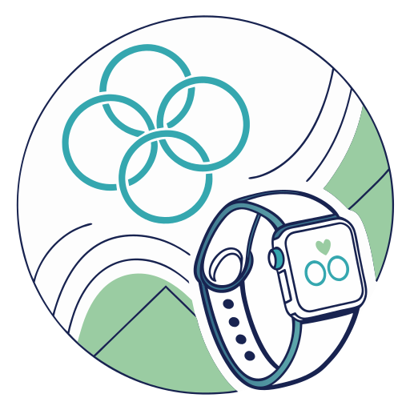
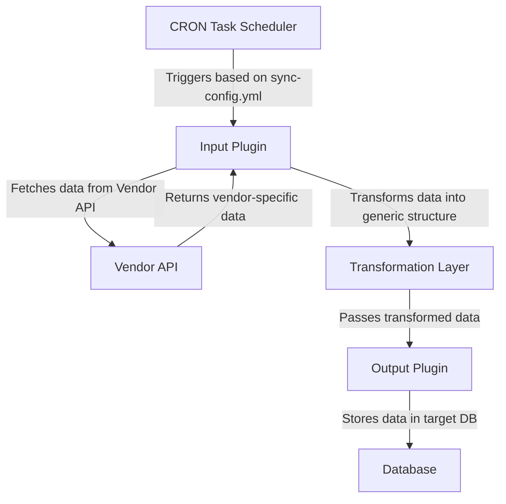

<div>
    
    <h1 style="display: inline; vertical-align: middle;">MyWellnessSync</h1>
</div>

MyWellnessSync is a vendor-neutral web API designed to synchronize and store health data from multiple wearable device vendors (e.g., Garmin, Fitbit) in a unified format. This project is extensible and supports custom plugins for data transformation and storage.

## Features
- **Vendor-Neutral Plugins**: Easily add plugins for new data providers.
- **Database Flexibility**: Output data to a variety of databases, currently supporting InfluxDB.
- **Background Synchronization**: Schedule periodic sync tasks using CRON expressions.
- **Manual Sync**: Trigger synchronization manually via API endpoints.


## System Design Flow



## Setup Instructions

### Prerequisites
- Docker installed on your system.
- Access to your desired database (e.g., InfluxDB).
- Vendor-specific credentials (e.g., Garmin API login).

### Building and Running
1. Clone the repository:
   ```bash
   git clone <repository-url>
   cd healthsync
   ```

2. Build the Docker image:
   ```bash
   docker build -t healthsync .
   ```

3. Run the Docker container:
   ```bash
   docker run -d -p 8080:8080 --name healthsync-container healthsync -v /path/to/sync-config.yml:/home/app/.config/health-sync/sync-config.yml
   ```

4. Access the application at `http://localhost:8080/swagger`.

### Sync Configuration Example
```yaml
# Maximum synchronization size in days
maxSyncSize: 1 # in days

# List of synchronization jobs
sync:
  - cron: 0 2 * * *
    # Index identifier for the synchronization job
    index: user1
    # Input (Provider) plugin configuration
    input:
        plugin: garmin-connect
        meta:
            # Login credentials for Garmin Connect
            login: XXX
            password: XXX
    # Output (Repository) plugin configuration
    output:
        plugin: influx-db
        meta:
            # Authentication token for InfluxDB
            token: XXX
            # Endpoint URL for InfluxDB
            endpoint: XXX
            # Target bucket in InfluxDB
            bucket: healthsync
            # Organization identifier in InfluxDB
            org: NA
  
  - cron: 0 2 * * *
    # Index identifier for the second synchronization job
    index: user2
    # Input (Provider) plugin configuration
    input:
        plugin: garmin-connect
        meta:
            # Login credentials for Garmin Connect
            login: YYY
            password: YYY
    # Output (Repository) plugin configuration
    output:
        plugin: influx-db
        meta:
            # Authentication token for InfluxDB
            token: XXX
            # Endpoint URL for InfluxDB
            endpoint: XXX
            # Target bucket in InfluxDB
            bucket: healthsync
            # Organization identifier in InfluxDB
            org: NA
```

### Environment Variables
The application supports the following environment variables for configuration:
- **`API_KEY`**: The API key for authenticating requests (optional).
- **`SYNC_DB_FILE`**: Path to the SQLite database file for cache storage (default: `sqlite.cache.db`).
- **`SYNC_CONFIG_PATH`**: Path to the YAML configuration file for sync tasks (default: `sync-config.yml`).
- **`CORS_HOSTS`**: Comma-separated list of allowed CORS origins (default: `*`).
- **`LOG_PATH`**: Path to the log file (default: `logs/applog-.txt`).
- **`API_EXPLORER`**: Enable Swagger API explorer (default: `false`).

### Exposed Port
- The application exposes port **8080** for incoming HTTP requests.

## API Endpoints
- **POST /api/sync/manual**: Trigger manual data synchronization.
- **GET /api/sync/{taskId}/lastSync**: Retrieve the last synchronization timestamp.

## Extending the Project
1. Create a new plugin by implementing the `IProviderPlugin` and `IRepositoryPlugin` interfaces.
2. Register your plugin in `ServiceCollectionExtensions`.

## License
This project is licensed under the MIT License. See the LICENSE file for details.

## Contributions
Feel free to fork this project, submit issues, and create pull requests. Contributions are welcome!
